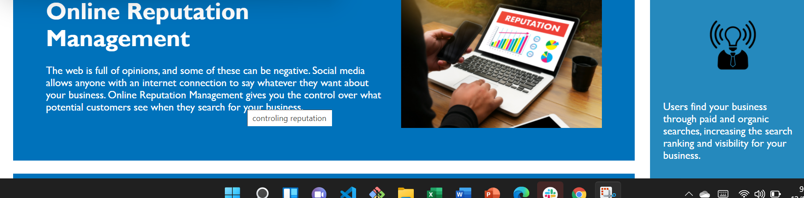

# Business_Plus
This web page is designed to inculcate methods to optimize search engines.This has created numerous opportunities for pepple to access important information,services,goods and other tools online .Web accessibilty is crucial for number of reasons ,many of which touch the social,economic,and legal fabric of society.

## Features added  for web accessibility:

1.  Used semantic html elements to provide better document strucrure.
    * header,footer,main,section,p,h

2.   Elements followed a logical structure.
 
3.  Icon and image elements included 'alt'attributes
    * It specifies alternative text to describe appearence and function of an image on page.

4.  Heading attributes fall in sequencial order.

    * heading elements are placed in sequential descending order.

5. Title is concise and descriptive

##URL

1.  URL of deployed application

2. URL of github repository  